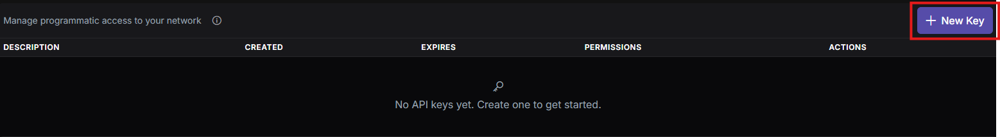
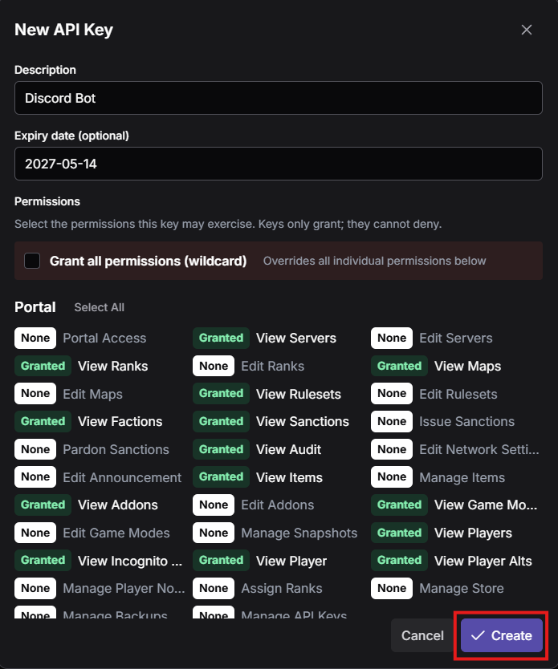
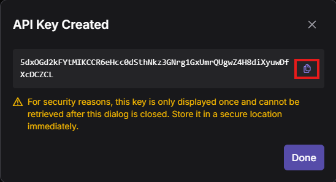

This documentation covers programmatic access to the DXRP network portal. All requests must be authenticated.

## Creating an API key

Go to your portal **Network → API Keys**, then click **+ New Key**.



**Step 1: Fill in the details**

| Field | Description |
| --- | --- |
| **Description** | A label to identify what uses this key (e.g. `Discord bot`, `whitelist sync`) |
| **Expiry date** | Optional. Leave as `Never` for a permanent key, or set a date to auto-expire it |
| **Permissions** | Select only the scopes your integration needs, see [Permissions](#permissions) below |

Use `Grant all permissions (wildcard)` only for fully trusted internal tools. For bots and third-party integrations, grant only the minimum required scopes.

**Step 2: Click Create**



**Step 3: Copy your key immediately**



Your API key is displayed **only once** and cannot be retrieved after you close the dialog. Store it in a secure location (password manager, secrets vault, `.env` file) right away.

To revoke a single key, use the **Revoke** action next to it. To invalidate all keys at once, use **Revoke All** on the API Keys page.

## Authentication

Every request needs two headers:

| Header | Description |
| --- | --- |
| `X-Api-Key` | Your API key from the portal |
| `X-Tenant` | Your network's tenant ID, see below |

```http
GET /api/v1/players HTTP/1.1
X-Api-Key: your_key_here
X-Tenant: your_tenant_here
```

**Finding your Tenant ID:** open the portal, press F12, go to the **Network** tab, then do anything (load a page, click around). Look at one of the requests going to the API and check its request headers. The `X-Tenant` value there is your tenant ID.

Don't put your API key in a public repo or client-side code. If it leaks, revoke it immediately from the portal.

## Rate limiting

10 requests per 10 seconds per key. Go over that and you get a `429`.

```http
HTTP/1.1 429 Too Many Requests
Retry-After: 5
```

Check the `Retry-After` header, it tells you exactly how many seconds to wait. Batch calls where you can, and if you hit a `429`, back off exponentially rather than hammering the same endpoint.

## Permissions

A key can only grant what you already have access to, it can't escalate your own permissions. Revoke anytime from the portal.

### Available scopes

| Scope | Description |
| --- | --- |
| `*` | Wildcard, grants everything |
| `portal.access` | Portal access |
| `servers.view` | View servers |
| `servers.edit` | Edit servers |
| `ranks.view` | View ranks |
| `ranks.edit` | Edit ranks |
| `maps.view` | View maps |
| `maps.edit` | Edit maps |
| `rulesets.view` | View rulesets |
| `rulesets.edit` | Edit rulesets |
| `factions.view` | View factions |
| `sanctions.view` | View sanctions |
| `sanctions.issue` | Issue sanctions |
| `sanctions.pardon` | Pardon sanctions |
| `audit.view` | View audit logs |
| `network.settings.edit` | Edit network settings |
| `announcements.edit` | Edit announcements |
| `items.view` | View items |
| `items.manage` | Manage items |
| `addons.view` | View addons |
| `addons.edit` | Edit addons |
| `gamemodes.view` | View game modes |
| `gamemodes.edit` | Edit game modes |
| `snapshots.manage` | Manage snapshots |
| `players.view` | View players |
| `players.view_incognito` | View incognito players |
| `player.view` | View a single player |
| `player.alts.view` | View player alts |
| `player.notes.manage` | Manage player notes |
| `ranks.assign` | Assign ranks |
| `store.manage` | Manage store |
| `backups.manage` | Manage backups |
| `apikeys.manage` | Manage API keys |

The `*` wildcard overrides every individual scope below it. Only use it when you fully trust whatever is holding the key.

## Endpoints

The full endpoint schema isn't documented yet. In the meantime, open the portal in your browser, press F12, go to the **Network** tab, and browse around. You'll see every API call the portal makes, which is your best reference for now.

## Error reference

| Code | Meaning |
| --- | --- |
| `200` | All good |
| `201` | Resource created |
| `400` | Bad request body or missing fields |
| `401` | Missing or wrong `X-Api-Key` / `X-Tenant` |
| `403` | Your key doesn't have the required scope |
| `404` | That resource doesn't exist |
| `429` | Rate limit hit, check `Retry-After` |
| `500` | Something broke on the server side |

## Examples

### List players

**cURL**

```bash
curl -X GET https://api.dxrp.net/api/v1/players \
  -H "X-Api-Key: your_key_here" \
  -H "X-Tenant: your_tenant_here"
```

**Node.js (fetch)**

```js
const res = await fetch("https://api.dxrp.net/api/v1/players", {
  headers: {
    "X-Api-Key": "your_key_here",
    "X-Tenant": "your_tenant_here",
  },
});
const data = await res.json();
console.log(data);
```

**Python (requests)**

```python
import requests

r = requests.get(
    "https://api.dxrp.net/api/v1/players",
    headers={
        "X-Api-Key": "your_key_here",
        "X-Tenant": "your_tenant_here",
    },
)
print(r.json())
```

**.NET (HttpClient)**

```csharp
using var client = new HttpClient();
client.DefaultRequestHeaders.Add("X-Api-Key", "your_key_here");
client.DefaultRequestHeaders.Add("X-Tenant", "your_tenant_here");

var response = await client.GetAsync("https://api.dxrp.net/api/v1/players");
var body = await response.Content.ReadAsStringAsync();
Console.WriteLine(body);
```

**PHP (cURL)**

```php
$ch = curl_init("https://api.dxrp.net/api/v1/players");
curl_setopt($ch, CURLOPT_RETURNTRANSFER, true);
curl_setopt($ch, CURLOPT_HTTPHEADER, [
    "X-Api-Key: your_key_here",
    "X-Tenant: your_tenant_here",
]);
$response = curl_exec($ch);
curl_close($ch);
echo $response;
```

---

Endpoint paths and field names here are based on the portal's permission structure. Double-check them against your actual running instance since they can vary between versions.
