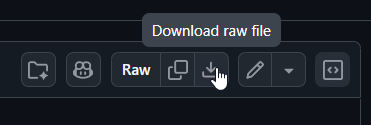

The `dxrp-server.cs` launcher runs a DXRP dedicated server that automatically keeps itself, the game code, and your network's addons up to date. On every startup it pulls the latest game code from GitHub, downloads your network's addons from the DXRP API, verifies everything builds, and launches (and restarts) the server for you.

> If you just want to get a community server running for the first time through the DXRP portal, see the [Operator Guide](/docs/operators/setting-up-a-server) instead. This page assumes you already have a server and an authorization token.

## Prerequisites

**1. Install the .NET 10 SDK**

Download from [dotnet.microsoft.com/download/dotnet/10.0](https://dotnet.microsoft.com/download/dotnet/10.0), run the installer, then verify it installed correctly:

```
dotnet --version
```

**2. Install Git**

Download from [git-scm.com/downloads](https://git-scm.com/downloads). The default install options are fine. Verify with:

```
git --version
```

## Setup

### 1. Place the launcher

Copy `dxrp-server.cs` into the same folder as `sbox-server.dll` (your s&box install, normally `steamapps/common/sbox/`):

```
steamapps/common/sbox/
├── sbox-server.dll
├── dxrp-server.cs           ← here
└── dxrp-server-config.json  ← created on first run
```

You can grab `dxrp-server.cs` straight from the [GitHub repository](https://github.com/dxura/dxrp/blob/main/dxrp-server.cs).



### 2. Run the launcher

Open a terminal in that folder and run:

```
dotnet run dxrp-server.cs
```

On first run it will:

- Create `dxrp-server-config.json` with default settings
- Ask for your server token if one isn't set yet

### 3. Enter your server token

Paste your token when prompted, or pass it directly on the command line:

```
dotnet run dxrp-server.cs --token YOUR_TOKEN
```

Don't have a token yet? Generate one from your server's **Actions** panel on the DXRP portal, see [step 4 of the Operator Guide](/docs/operators/setting-up-a-server#4-generate-an-authorization-token).

The token is saved to `dxrp-server-config.json` so you only need to do this once.

## What it does

Each time the launcher starts, it will:

1. Pull the latest game code from GitHub
2. Fetch your network's addons from the DXRP API
3. Clear and re-download all addon files
4. Build and verify the code compiles
5. Launch the server, restarting it automatically if it stops

## Configuration (`dxrp-server-config.json`)

| Key | Default | Description |
| --- | --- | --- |
| `token` | *(empty)* | Your server token |
| `repoUrl` | GitHub URL | Repository to clone |
| `branch` | `main` | Branch to pull |
| `apiEndpoint` | `https://api.dxrp.net` | DXRP API URL |
| `map` | *(empty)* | Map to load on start (e.g. `dm_test`) |
| `extraArgs` | *(empty)* | Any additional launch arguments |
| `verifyAddons` | `false` | Set to `true` to enable build verification before launch |

## Troubleshooting

**`sbox-server.dll not found`**
Make sure you're running the launcher from the same folder as `sbox-server.dll`.

**`git exited with code 128`**
Usually a network issue or a bad repo URL. Check `repoUrl` in your config.

**`API error: ...`**
Your token may be invalid or expired. Re-run with `--token YOUR_TOKEN` to set a fresh one.

**Build errors shown on startup**
The addon code failed to compile. Errors are shown with the file and line number. Fix the issue in the addon, or set `verifyAddons: false` in your config to skip verification.
