A complete walkthrough for standing up a DXRP community server through the [DXRP portal](https://dxrp.net): logging in, configuring a map, generating an authorization token, and starting the server on Windows or Linux.

> Once your server is running and you want it to auto-pull the latest game code and your network's addons on every start, follow up with [Launching a Server with Addons](/docs/operators/launching-server-with-addons).

<div class="video-embed">
  <iframe
    src="https://www.youtube.com/embed/ciur3Iesvzs"
    title="Setting up a DXRP community server"
    frameborder="0"
    allow="accelerometer; autoplay; clipboard-write; encrypted-media; gyroscope; picture-in-picture; web-share"
    allowfullscreen></iframe>
</div>

## 1. Log into the DXRP website

Go to [dxrp.net](https://dxrp.net) and log in.

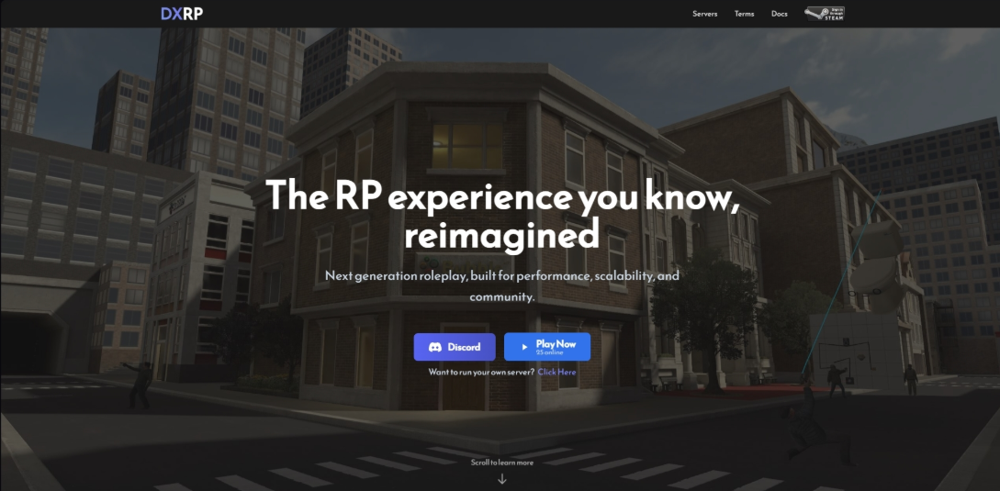

Log in using your Steam account, top right.

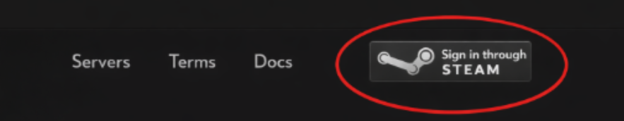

## 2. Dashboard

Once logged in, you'll land on your **Dashboard**.

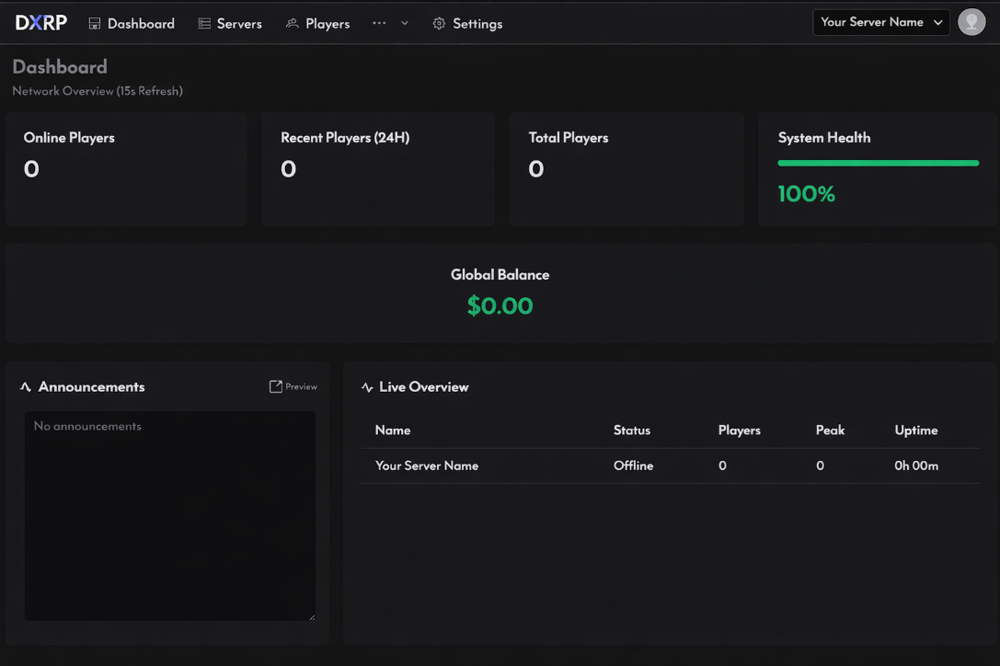

- In the top-right corner you'll see your **Server Name**.
- The top-left header has: **Dashboard | Servers | Players | …v | Settings**

Click the **Servers** tab to open the page showing your servers.

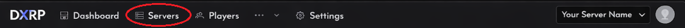

Click on your server's name.

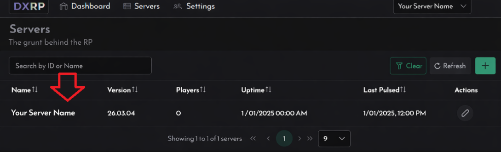

This opens the **Server Status Page**.

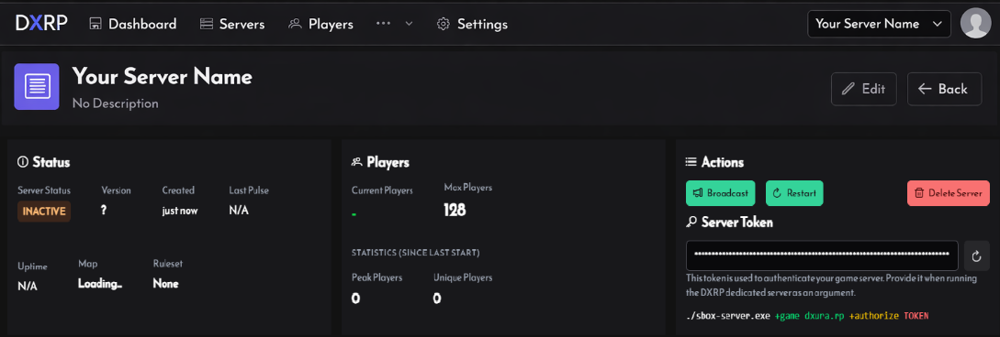

## 3. Adding a map

Select your map by clicking **Edit** and using the **Map** drop-down menu.

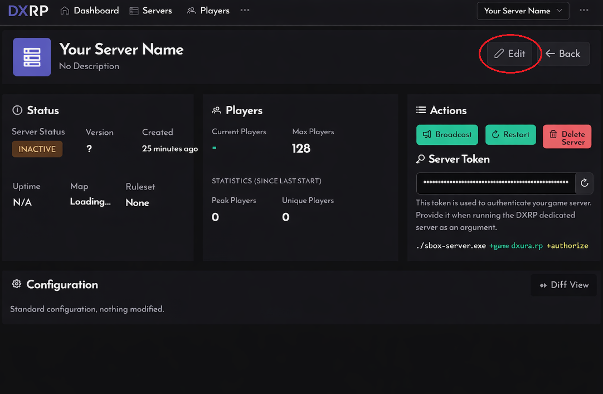

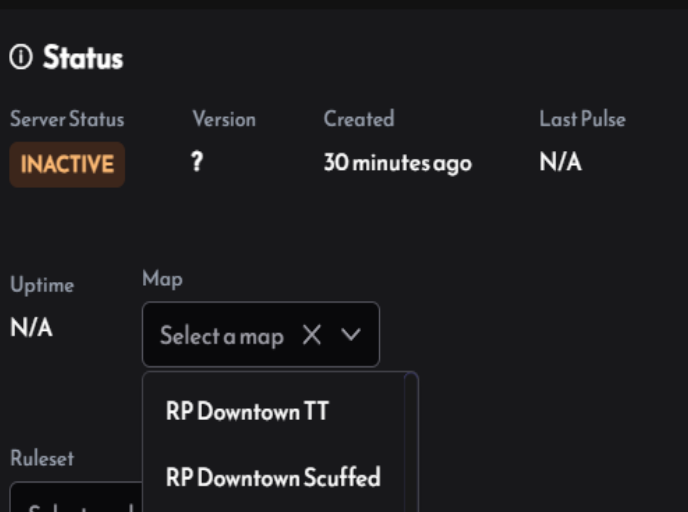

Or select **Custom** from the **…v** drop-down menu.

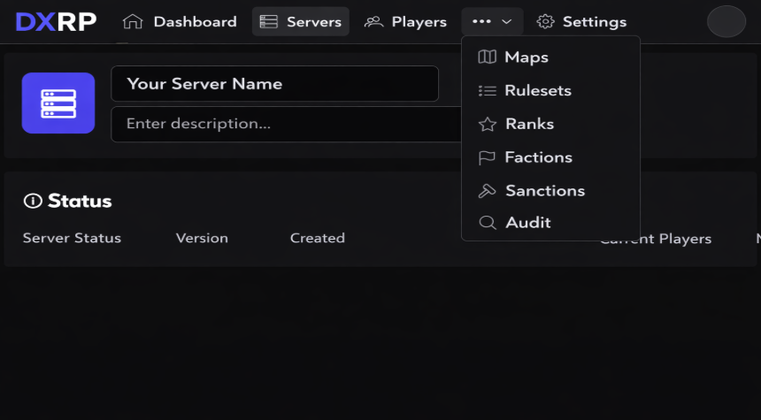

Press the **Add** button.

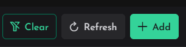

Paste in your custom map. It uses the last part of the s&box website URL, replacing every `/` with a `.`.

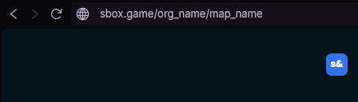

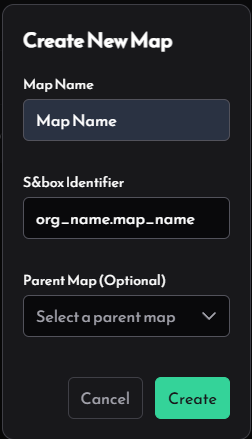

For custom maps, you'll need to build a prefab with all the fittings inside the s&box Editor and upload it in the map edit section.

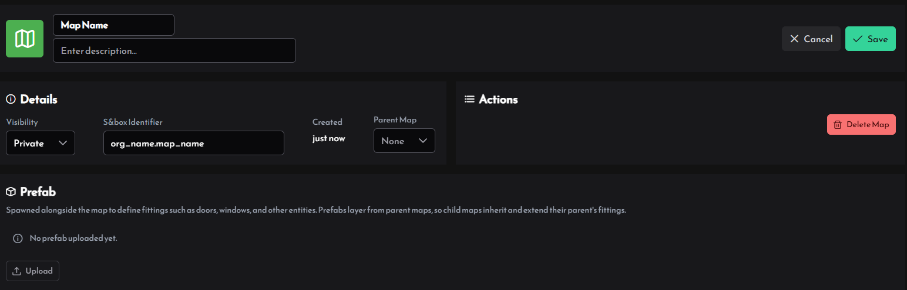

## 4. Generate an authorization token

On the right-hand side of the server status page, find the **Actions** section and click the refresh icon ↻ labeled **Regenerate Token**.

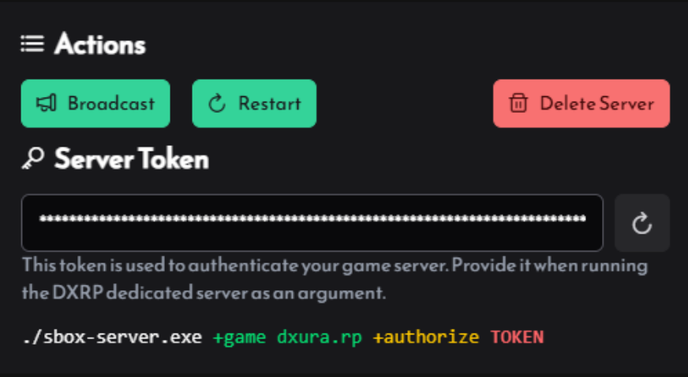

After it regenerates, click the token to copy it to your clipboard. You'll need it for the launch command:

```
./sbox-server.exe +game dxura.rp +authorize TOKEN
```

Replace `TOKEN` with the token you copied.

### Game directory

Open your s&box installation folder. The default location is usually:

```
C:\Program Files (x86)\Steam\steamapps\common\sbox
```

**Windows 10**: hold Shift + right-click inside the folder, then click **Open PowerShell window here**.

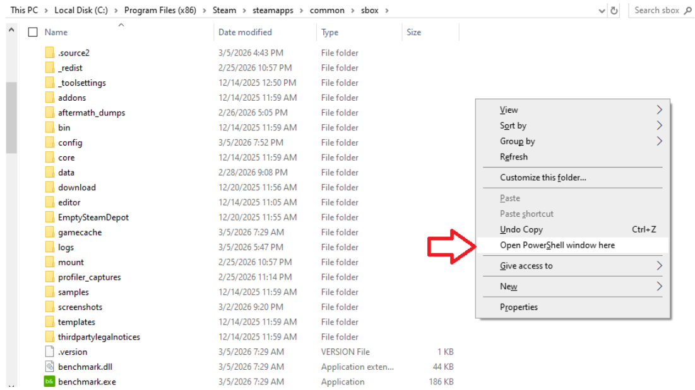

**Windows 11**: right-click the folder and click **Open in Terminal**.

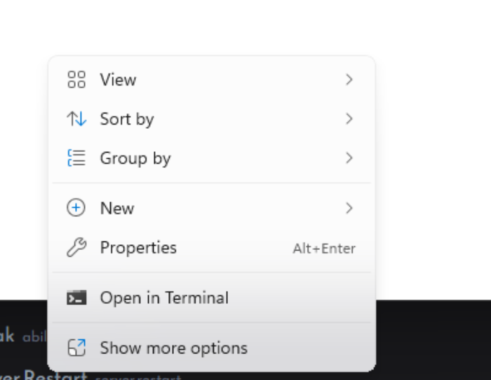

## 5. Starting the server

In the PowerShell/Terminal window, paste the launch command:

```
./sbox-server.exe +game dxura.rp +authorize TOKEN
```

Replace `TOKEN` with the token you copied earlier, then press Enter. The server should begin loading.

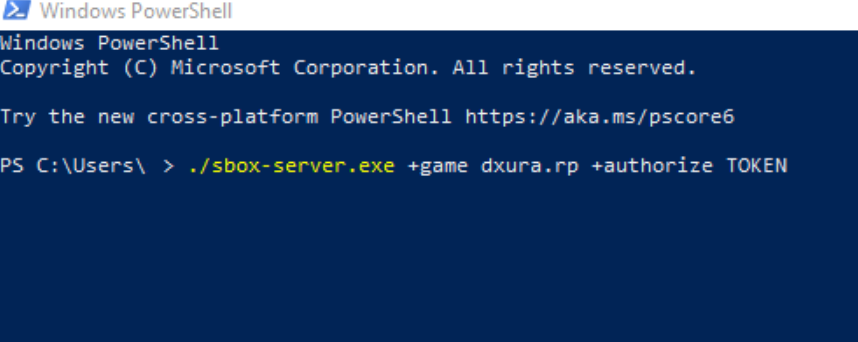

### Creating an auto-restart script

To make sure your server automatically restarts if it stops or crashes, create a restart loop as a batch file.

Open Notepad and paste:

```bat
@echo off
title sbox-server - dxura.rp
color 0A

:start
echo [%date% %time%] Starting sbox-server...
echo ----------------------------------------

"C:\Program Files (x86)\Steam\steamapps\common\sbox\sbox-server.exe" +game dxura.rp +authorize YOUR_TOKEN_HERE

echo.
echo [%date% %time%] Server stopped or crashed.
echo Restarting in 5 seconds... (Press CTRL+C to cancel)
echo.
timeout /t 5 /nobreak
goto start
```

Save the file as `start-server.bat`. Make sure the file type is set to **All Files**, not `.txt`.

## 6. Edit the server path

Change the executable path in the script to match your actual s&box server install, for example:

```
C:\Program Files (x86)\Steam\steamapps\common\sbox\sbox-server.exe
```

Also replace `YOUR_TOKEN_HERE` with your authorization token.

## 7. Running the server

Double-click `start-server.bat`. This starts the server and automatically restarts it if it stops or crashes.

## 8. Running the server with Docker (Linux)

An official Docker image is available to run a DXRP server on Linux with automatic updates via SteamCMD.

**Image:** `dxura/sbox:latest`

```bash
docker run -d --restart unless-stopped dxura/sbox:latest +game dxura.rp +authorize <TOKEN>
```

Replace `<TOKEN>` with the authorization token generated in [step 4](#4-generate-an-authorization-token).

The `--restart unless-stopped` flag ensures the container automatically restarts if it stops or crashes, the same thing the batch script does in [step 5](#5-starting-the-server).

Any standard s&box dedicated server arguments can be appended at the end. See the [official s&box dedicated server documentation](https://sbox.game/dev/doc/systems/networking-multiplayer/dedicated-servers/) for the full list.

---

Your DXRP community server should now be running. To keep the game code and any network addons up to date automatically, see [Launching a Server with Addons](/docs/operators/launching-server-with-addons).
